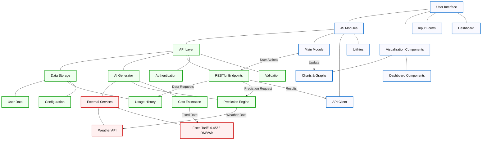
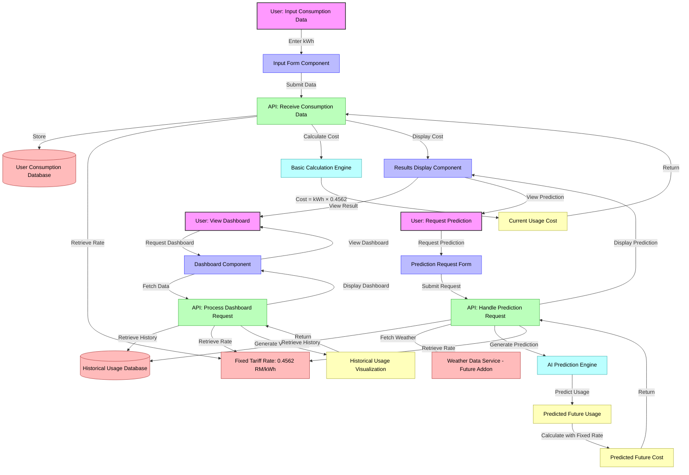

# EnergiWatch-MVP Architecture Diagrams

Below are comprehensive Mermaid diagrams representing the key architectures of the EnergiWatch-MVP app. These diagrams cover the main system architecture, data flow, and module relationships for clarity and ease of understanding.

---

## 1. System Architecture



### System Architecture Diagram Explanation

This architecture diagram illustrates the complete structure of the EnergiWatch-MVP application, showing how different components interact to deliver energy consumption monitoring and cost calculation functionality.

#### Key Components

**Frontend Layer:**

- **User Interface**: The main interface that users interact with, consisting of input forms for entering consumption data and dashboards for viewing results.
- **JS Modules**: Core JavaScript modules that handle application logic, including the main module that orchestrates functionality, an API client for backend communication, and utility modules for common functions.
- **Visualization Components**: Specialized components for data presentation, including charts, graphs, and dashboard elements that display consumption data and cost calculations.

**Backend Layer:**

- **API Layer**: Handles all communication between frontend and backend, including RESTful endpoints, authentication, and data validation to ensure security and data integrity.
- **Data Storage**: Manages persistent data including user information, historical usage data, and application configuration settings.
- **AI Generator**: Provides predictive capabilities for consumption forecasting and cost estimation, but importantly uses a fixed tariff rate rather than generating variable rates.

**External Services:**

- **Weather API**: External data source for weather information that may influence energy consumption predictions.
- **Fixed Tariff Rate**: A constant rate of 0.4562 RM/kWh used for all cost calculations, which remains unchanged regardless of AI predictions.

#### Key Data Flows

1. User actions from the frontend are processed by JS modules and sent to the API layer
2. The API layer interacts with data storage to retrieve or store information
3. For predictions, the API layer invokes the AI Generator
4. The AI Generator may use weather data but always applies the fixed tariff rate of 0.4562 RM/kWh
5. Results flow back through the API to the frontend for visualization

#### Design Principles

- **Separation of Concerns**: Clear boundaries between frontend, backend, and external services
- **Modular Design**: Components are organized into logical groups that can be developed and maintained independently
- **Fixed Pricing Model**: The system uses a constant tariff rate that isn't affected by the AI generator, ensuring predictable cost calculations

---

## 2. Data Flow: Tariff Calculation (Fixed Rate)



### Data Flow Diagram Explanation

This data flow diagram illustrates the three primary user journeys in the EnergiWatch-MVP application and how data moves through the system for each scenario. The diagram emphasizes the consistent use of the fixed tariff rate across all calculations.

#### User Journeys

**1. Current Consumption Calculation:**

- User enters their consumption data in kilowatt-hours (kWh)
- The system retrieves the fixed tariff rate of 0.4562 RM/kWh
- A simple calculation multiplies consumption by the fixed rate
- Results are displayed to the user showing their current usage cost

**2. Dashboard View:**

- User requests to view their energy usage dashboard
- The system retrieves historical usage data and the fixed tariff rate
- Visualizations are generated showing usage patterns and associated costs
- The dashboard is displayed to the user with all relevant information

**3. Future Usage Prediction:**

- User requests a prediction of future energy usage and costs
- The system retrieves historical data and relevant weather information (from planned future Weather Data Service)
- The AI prediction engine generates usage forecasts
- Importantly, cost calculations always use the fixed tariff rate of 0.4562 RM/kWh
- Predicted usage and costs are displayed to the user

#### Flow Components

- **User Interface Components**: Forms for data input and components for displaying results
- **API Endpoints**: Specialized endpoints for handling different types of requests
- **Data Sources**: User data, historical data, weather data, and the fixed tariff rate
- **Calculation Engines**: Basic calculation for current usage and AI-powered prediction for future usage
- **Result Types**: Current costs, historical visualizations, and future predictions

#### Important Notes

- Across all flows, the tariff rate remains constant at 0.4562 RM/kWh. This fixed rate is used for both current calculations and future predictions, ensuring consistent and predictable cost estimates for users regardless of the AI prediction capabilities.
- The Weather Data Service shown in the diagram is marked as a future addon and is not yet implemented in the current codebase. When implemented, it will enhance prediction accuracy by incorporating weather patterns into the AI model.

---

## 3. Module Relationships

```mermaid
graph TD
    main.js
      ├── ui.js
      │   ├── chartUtils.js
      │   └── recommendations.js
      ├── state.js
      ├── storage.js
      ├── logic.js
      │   └── aiService.js
      ├── eventHandlers.js
      ├── logger.js (Optional)
      └── data.js (Optional)
```

### Module Relationships Diagram Explanation

This diagram illustrates the relationships between the JavaScript modules that make up the EnergiWatch-MVP application. It shows the dependency structure and how the modules interact with each other.

#### Module Functions

- **main.js**: The entry point of the application that orchestrates the overall functionality by coordinating other modules.
- **ui.js**: Manages the user interface components, handling user inputs and displaying results.
- **logic.js**: Contains the business logic for energy consumption calculations and tariff application.
- **data.js**: Manages data structures and transformations for the application.
- **state.js**: Handles application state management across components.
- **storage.js**: Provides functionality for data persistence and retrieval.
- **aiService.js**: Interfaces with AI prediction capabilities while maintaining fixed tariff rates.
- **eventHandlers.js**: Manages user interactions and event processing.
- **logger.js**: Provides logging functionality throughout the application.

#### Dependency Structure

- The **main.js** module serves as the application entry point, coordinating UI, logic, and event handling.
- The **ui.js** module depends on state and data modules to render and update the interface.
- The **logic.js** module contains the core business logic, including the fixed tariff calculations.
- The **data.js** module provides structured data access to other modules.
- The **aiService.js** module handles predictions while ensuring the fixed tariff rate is applied.

#### Implementation Note

The fixed tariff rate of 0.4562 RM/kWh is implemented in the **logic.js** module as a constant value, ensuring it's consistently applied across all calculations in the application. This architectural decision ensures that the tariff rate remains constant regardless of any AI-generated predictions.

---

> **Note:**
>
> - The tariff rate is fixed at 0.4562 RM/kWh and is not affected by the AI generator.
> - The diagrams are kept spacious and organized for readability.
