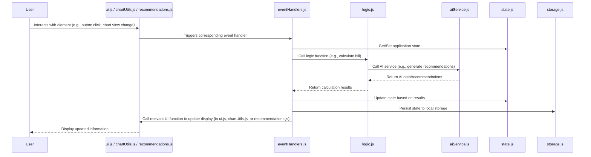

# Application Execution Sequence Diagrams

This document provides two sequence diagrams illustrating the flow of execution within the EnergiWatch-MVP application. The first diagram offers a high-level overview, while the second provides a more detailed look at specific user interaction flows.

## 1. High-Level Execution Sequence Diagram

This diagram shows the general flow of data and control between the main architectural layers of the application during a typical user interaction.

### Explanation of the High-Level Diagram

This diagram simplifies the application's operation into key stages. When a **User** interacts with the **UI** (e.g., clicking a button, changing chart view), the relevant UI module (`ui.js`, `chartUtils.js`, or `recommendations.js`) triggers an event. This event is captured by the **EventHandlers** module, which acts as the central coordinator. **EventHandlers** then interacts with the **State** module to access or modify data. For calculations, it calls the **Logic** module, which then uses the **AIService**. Results are returned to **EventHandlers**, which updates **State** and **Storage**. Finally, **EventHandlers** instructs the appropriate UI module (`ui.js`, `chartUtils.js`, or `recommendations.js`) to update the display, showing the result to the **User**.

## 2. Detailed Execution Sequence Diagram

This diagram provides a more granular view of the function calls and interactions between specific JavaScript modules during application initialization and key user actions like generating demo data, getting recommendations, and toggling appliance settings.

```mermaid
sequenceDiagram
    participant Browser
    participant Main as main.js
    participant UI as ui.js
    participant ChartUtils as chartUtils.js
    participant RecommendationsMod as recommendations.js
    participant State as state.js
    participant EventHandlers as eventHandlers.js
    participant Logic as logic.js
    participant AIService as aiService.js
    participant Storage as storage.js

    %% Initialization Flow
    Browser->>Main: DOMContentLoaded event
    Main->>State: initializeState()
    Main->>UI: loadDarkModePreference()
    Main->>ChartUtils: createEnergyChart()  // Changed from UI to ChartUtils
    Main->>EventHandlers: Add event listeners (darkModeToggle, budgetInput, chart view buttons, etc.)
    Main->>UI: initUsageModeToggle() with callback
    UI-->>Main: Returns callback function
    Main->>EventHandlers: Add event delegation (essential-toggle, continuous-toggle)
    Main->>EventHandlers: handleAIDemoData() (Initial call)

    %% handleAIDemoData Flow (Initial or Button Click)
    EventHandlers->>RecommendationsMod: showRecommendationsLoading() // Changed from UI to RecommendationsMod
    EventHandlers->>AIService: generateDemoData()
    AIService-->>EventHandlers: Returns demo data (appliances, solarData, usageData)
    EventHandlers->>State: setAppliances(data.appliances)
    EventHandlers->>State: setSolarData(data.solarData)
    EventHandlers->>State: setUsageData(data.usageData)
    EventHandlers->>UI: renderApplianceList(getAppliances())
    EventHandlers->>UI: renderTariffEditor(0.4562, handleTariffSave)
    EventHandlers->>State: getAppliances(), getSolarData(), getTariffData()
    EventHandlers->>Logic: calculateCurrentEstimatedBill(...)
    Logic-->>EventHandlers: Returns currentBill
    EventHandlers->>UI: updateBillOverview(currentBill, budget, solarData)
    EventHandlers->>State: getAppliances()
    EventHandlers->>Logic: calculateMonthlyEnergyUsage(appliances)
    Logic-->>EventHandlers: Returns monthlyUsage
    EventHandlers->>State: getSolarData()
    EventHandlers->>ChartUtils: updateEnergyChart(monthlyUsage, monthlySolar) // Changed from UI to ChartUtils
    EventHandlers->>RecommendationsMod: showRecommendationsLoading() // Changed from UI to RecommendationsMod
    EventHandlers->>State: getAppliances(), getBudget(), getSolarData(), getTariffData()
    EventHandlers->>Logic: generateOptimisationAdvice(...)
    Logic->>AIService: generateOptimisationRecommendations(...)
    AIService-->>Logic: Returns recommendations
    Logic-->>EventHandlers: Returns recommendations
    EventHandlers->>RecommendationsMod: displayRecommendations(recommendations) // Changed from UI to RecommendationsMod
    EventHandlers->>UI: Update AI demo status

    %% handleAIRecommendations Flow (Button Click or Usage Mode Toggle Callback)
    User->>UI: Clicks "Get AI Recommendations" button OR Usage Mode Toggle callback triggers
    UI->>EventHandlers: handleAIRecommendations()
    EventHandlers->>RecommendationsMod: showRecommendationsLoading() // Changed from UI to RecommendationsMod
    EventHandlers->>State: getAppliances(), getSolarData(), getTariffData(), getUsageMode()
    EventHandlers->>Logic: calculateCurrentEstimatedBill(...)
    Logic-->>EventHandlers: Returns currentBill
    EventHandlers->>AIService: generateOptimisationRecommendations(inputData)
    AIService-->>EventHandlers: Returns advice
    EventHandlers->>RecommendationsMod: displayRecommendations(advice) // Changed from UI to RecommendationsMod

    %% handleChartViewChange Flow (e.g., User clicks 'Day' view button)
    User->>ChartUtils: Clicks view button (e.g., dayViewBtn)
    ChartUtils->>EventHandlers: handleChartViewChange('day') // Or 'week', 'month'
    EventHandlers->>ChartUtils: updateChartView('day')
    EventHandlers->>State: getUsageData(), getSolarData()
    EventHandlers->>ChartUtils: updateEnergyChart(aggregatedUsage, aggregatedSolar)

    %% handleEssentialToggle / handleContinuousToggle Flow
    User->>UI: Clicks Essential or Continuous toggle
    UI->>EventHandlers: handleEssentialToggle() or handleContinuousToggle()
    EventHandlers->>State: getAppliances()
    EventHandlers->>State: setAppliances(updatedAppliances)
    EventHandlers->>UI: renderApplianceList(updatedAppliances)
    opt handleEssentialToggle only
        EventHandlers->>State: getAppliances(), getSolarData(), getTariffData()
        EventHandlers->>Logic: calculateCurrentEstimatedBill(...)
        Logic-->>EventHandlers: Returns currentBill
        EventHandlers->>UI: updateBillOverview(currentBill, budget, solarData)
    end

    %% handleBudgetChange Flow
    User->>UI: Changes Budget input
    UI->>EventHandlers: handleBudgetChange()
    EventHandlers->>State: getAppliances(), getUsageData(), getSolarData()
    opt If no usage data
        EventHandlers->>AIService: generateLocalDemoData()
        AIService-->>EventHandlers: Returns local demo data
        EventHandlers->>State: setUsageData(localData.usageData)
        EventHandlers->>AIService: generateDemoData() (in background)
        AIService-->>EventHandlers: Returns AI demo data
        EventHandlers->>State: setUsageData(AI data)
        EventHandlers->>State: getSolarData()
        EventHandlers->>ChartUtils: updateEnergyChart(usageData, solarData) // Changed from UI to ChartUtils
    end
    opt If no solar data
        EventHandlers->>AIService: generateLocalDemoData()
        AIService-->>EventHandlers: Returns local demo data
        EventHandlers->>State: setSolarData(localData.solarData)
        EventHandlers->>AIService: generateDemoData() (in background)
        AIService-->>EventHandlers: Returns AI demo data
        EventHandlers->>State: setSolarData(AI data)
        EventHandlers->>State: getUsageData()
        EventHandlers->>ChartUtils: updateEnergyChart(usageData, solarData) // Changed from UI to ChartUtils
    end
    EventHandlers->>State: getAppliances(), getSolarData(), getTariffData()
    EventHandlers->>Logic: calculateCurrentEstimatedBill(...)
    Logic-->>EventHandlers: Returns currentBill
    EventHandlers->>UI: updateBillOverview(currentBill, budget, solarData)

    %% handleTariffSave Flow
    User->>UI: Saves Tariff (via renderTariffEditor callback)
    UI->>EventHandlers: handleTariffSave(newTariff)
    EventHandlers->>State: setTariffData(0.4562)
    EventHandlers->>Storage: saveTariffToStorage(0.4562)
    EventHandlers->>State: getAppliances(), getSolarData(), getTariffData()
    EventHandlers->>Logic: calculateCurrentEstimatedBill(...)
    Logic-->>EventHandlers: Returns currentBill
    EventHandlers->>RecommendationsMod: showRecommendationsLoading() // Changed from UI to RecommendationsMod
    EventHandlers->>State: getAppliances(), getBudget(), getSolarData(), getTariffData()
    EventHandlers->>Logic: generateOptimisationAdvice(...)
    Logic->>AIService: generateOptimisationRecommendations(...)
    AIService-->>Logic: Returns recommendations
    Logic-->>EventHandlers: Returns recommendations
    EventHandlers->>RecommendationsMod: displayRecommendations(recommendations) // Changed from UI to RecommendationsMod
    EventHandlers->>UI: updateBillOverview(currentBill, budget, solarData)
    EventHandlers->>UI: Update Bill Overview text
```

### Explanation of the Low-Level Flow Diagram

This diagram provides a more technical breakdown of the application's flow, detailing specific function calls and interactions between modules during key processes.

- **Initialization:** The process starts with `DOMContentLoaded`, triggering `main.js::init`. This calls `state.js::initializeState`, `ui.js::loadDarkModePreference`, `chartUtils.js::createEnergyChart`, and `ui.js::initUsageModeToggle`. It also sets up event listeners in `eventHandlers.js` and triggers an initial `eventHandlers.js::handleAIDemoData`.
- **`handleAIDemoData`:** In `eventHandlers.js`, this function first calls `recommendations.js::showRecommendationsLoading`. It fetches demo data using `aiService.js::generateDemoData`, updates state (`setAppliances`, `setSolarData`, `setUsageData`), and then calls `ui.js` functions (`renderApplianceList`, `renderTariffEditor`, `updateBillOverview`). It updates the chart via `chartUtils.js::updateEnergyChart`. Finally, it gets and displays advice using `logic.js::generateOptimisationAdvice` (which calls `aiService.js`) and `recommendations.js::displayRecommendations`.
- **`handleAIRecommendations`:** Triggered by UI events, this `eventHandlers.js` function calls `recommendations.js::showRecommendationsLoading`. It gets state, calculates the bill (`logic.js`), gets recommendations from `aiService.js`, and displays them via `recommendations.js::displayRecommendations`.
- **`handleChartViewChange`:** User interaction with chart view buttons (in HTML, managed by `chartUtils.js` for styling) triggers this in `eventHandlers.js`. It calls `chartUtils.js::updateChartView` to update button styles and internal view state, then gets data from `state.js` and calls `chartUtils.js::updateEnergyChart` to re-render the chart with aggregated data for the new view.
- **`handleEssentialToggle` / `handleContinuousToggle`:** These `eventHandlers.js` functions update appliance state in `state.js` and call `ui.js::renderApplianceList`. `handleEssentialToggle` also recalculates the bill and updates the overview.
- **`handleBudgetChange`:** In `eventHandlers.js`, this retrieves data from `state.js`. It may fetch demo data (`aiService.js`) and update `state.js` and `chartUtils.js::updateEnergyChart`. It then recalculates the bill and updates the overview via `ui.js`.
- **`handleTariffSave`:** In `eventHandlers.js`, this updates tariff in `state.js` and `storage.js`. It recalculates the bill, gets new advice (via `logic.js` and `aiService.js`), and updates UI via `recommendations.js::displayRecommendations` and `ui.js::updateBillOverview`.
